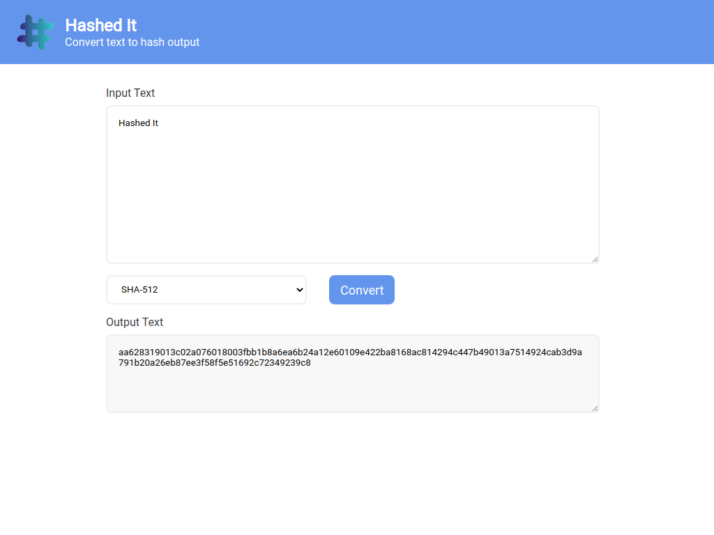
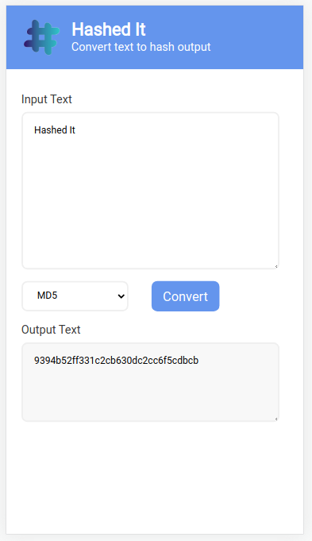

# Hashed-It

An FullStack *Spring Boot* application to generate hash output.

### UI

Minimal frontend to see the application in action. Build with *Thymeleaf* and *CSS*.

### Demo

<p align="center">
    
    
</p>

### API End Points

> **All the types** <br>

`/api/v1/types`

``` json
[
    "MD2",
    "MD5",
    "SHA",
    "SHA-224",
    "SHA-256",
    "SHA-384",
    "SHA-512",
    "SHA-512/224",
    "SHA-512/256"
]
```

> **MD5 Hash**

`/api/v1/MD5?input=test`

``` json
{
    "input": "test",
    "output": "98f6bcd4621d373cade4e832627b4f6",
    "hashType": "MD5"
}
```

> **SHA-256 Hash**

`/api/v1/sha-256?input=test`

``` json
{
    "input": "test",
    "output": "9f86d081884c7d659a2feaa0c55ad015a3bf4f1b2b0b822cd15d6c15b0f00a08",
    "hashType": "sha-256"
}
```
